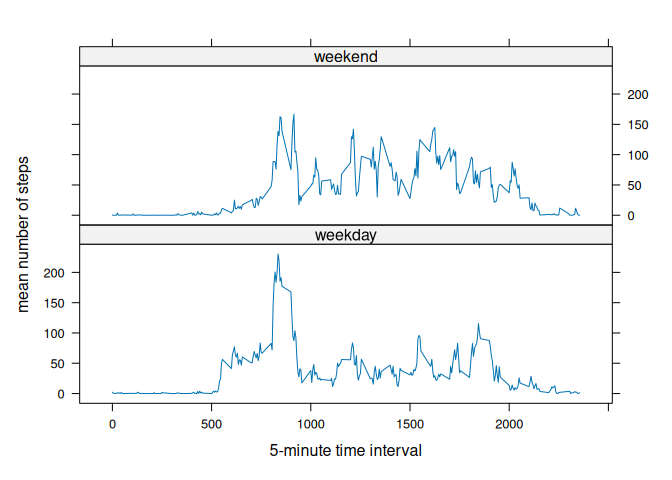

Analysis of activity monitoring data for Coursera Reproducible Research course (Course Project 1).

``` r
library(knitr)
library(dplyr)
```

```
## 
## Attaching package: 'dplyr'
```

```
## The following objects are masked from 'package:stats':
## 
##     filter, lag
```

```
## The following objects are masked from 'package:base':
## 
##     intersect, setdiff, setequal, union
```

``` r
library(lubridate)
```

```
## 
## Attaching package: 'lubridate'
```

```
## The following objects are masked from 'package:base':
## 
##     date, intersect, setdiff, union
```

``` r
library(lattice)
```


``` r
opts_chunk$set(echo = TRUE)

# ensure numbers formatted in inline text are not in scientific notation
options(scipen = 999)
```


## Loading and preprocessing the data

Note that this step assumes that the activity.csv file has been unzipped and is located in the working directory.

``` r
activity <- read.csv("activity.csv")
```


## What is mean total number of steps taken per day?


``` r
by_day <- activity |> 
  group_by(date) |> 
  summarize(total = sum(steps, na.rm = TRUE))

by_day
```

```
## # A tibble: 61 × 2
##    date       total
##    <chr>      <int>
##  1 2012-10-01     0
##  2 2012-10-02   126
##  3 2012-10-03 11352
##  4 2012-10-04 12116
##  5 2012-10-05 13294
##  6 2012-10-06 15420
##  7 2012-10-07 11015
##  8 2012-10-08     0
##  9 2012-10-09 12811
## 10 2012-10-10  9900
## # ℹ 51 more rows
```


``` r
hist(by_day$total, 
     breaks = 15, # increase number of bins; default doesn't give a good sense of the pattern
     main = "Histogram of total steps taken per day",
     xlab = "number of steps")
```

<!-- -->


``` r
mean_steps <- mean(by_day$total)
median_steps <- median(by_day$total)
```
With missing values ignored, the mean number of steps taken per day was 9354 and the median was 10395. (All means in text are rounded to whole numbers.)

## What is the average daily activity pattern?


``` r
by_interval <- activity |> 
  group_by(interval) |> 
  summarize(mean_steps = mean(steps, na.rm = TRUE))

with(by_interval, plot(interval, mean_steps, 
                       type = "l",
                       xlab = "5-minute time interval",
                       ylab = "mean number of steps",
                       main = "Average daily activity pattern"))
```

<!-- -->


``` r
max_interval <- by_interval[by_interval$mean_steps == max(by_interval$mean_steps, na.rm = TRUE), ]
```

The 5-minute interval with the highest average number of steps was interval 835, with an average 206 steps taken.


## Imputing missing values


``` r
n_missing <- sum(is.na(activity$steps))
```

There are 2304 missing values in the dataset.

Missing values will be imputed using the mean value for the same interval.

First, add a column to the dataset showing the mean number of steps for each interval. Note that this works because the intervals repeat and are always in the same order.

``` r
activity$interval_mean <- by_interval$mean_steps
```

Next, create a steps_imputed column containing the actual steps for that interval if they were recorded, and the mean otherwise. Finally, remove the interval_mean column.

``` r
activity <- activity |> 
  mutate(steps_imputed = if_else(is.na(steps),
                                 interval_mean,
                                 steps)) |> 
  select(-interval_mean)
```

Summarize the data by day, as above, but now using the imputed data.

``` r
by_day_imputed <- activity |> 
  group_by(date) |> 
  summarize(total = sum(steps_imputed, na.rm = TRUE))
```

Make the histogram.

``` r
hist(by_day_imputed$total, 
     breaks = 15, 
     main = "Histogram of total steps taken per day (missing data imputed)",
     xlab = "number of steps")
```

<!-- -->

Compared to the previous histogram without imputed data, this version lacks the peak in the smallest bin (0-2000 steps) and has a higher peak in the center (10000-12000 steps).


``` r
mean_steps_imputed <- mean(by_day_imputed$total)
median_steps_imputed <- median(by_day_imputed$total)
```

With missing values ignored, the mean number of steps taken per day was 10766 and the median was 10766. The median and mean are the same value, which is the number of steps imputed for days in which all data was missing. The mean is higher than it was when missing values were ignored, as expected since there are now fewer days with low number of steps. 


## Are there differences in activity patterns between weekdays and weekends?

Convert the date column to a date format, then use weekdays() to find the day of the week. Then make a new variable indicating whether the date is a weekday or a weekend day.

``` r
activity <- activity |> 
  mutate(date = ymd(date),
         weekday = if_else(weekdays(date) %in% c("Saturday", "Sunday"),
                           "weekend",
                           "weekday"),
         weekday = as.factor(weekday))
```


``` r
by_interval_wkday <- activity |> 
  group_by(interval, weekday) |> 
  summarize(mean_steps = mean(steps_imputed))
```

```
## `summarise()` has grouped output by 'interval'. You can override using the
## `.groups` argument.
```

Make graph using lattice system:

``` r
xyplot(mean_steps ~ interval | weekday, 
       data = by_interval_wkday, 
       type = "l", 
       layout = c(1, 2),
       xlab = "5-minute time interval",
       ylab = "mean number of steps")
```

<!-- -->

